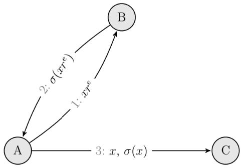

# Лабораторная работа 4: Создание и верификация цифровой подписи

## Постановка задачи

Реализуйте простое клиент-серверное приложение, позволяющее аккумулировать короткие анонимные сообщения (систему электронного голосования) согласно следующей схеме:

Здесь: _A_ – пользователь (избиратель), _B_ – регистратор, _C_ – счетчик, _x_ – сообщение (голос), _r_ – известное только участнику _A_ случайное число, _(e, n)_ – открытый ключ банка. Пренебрегите реализацией правильных механизмов распределения, хранения и сертификации ключей.

## Описание решения

Перед началом следует обратить внимание на два вспомогательных метода:

1. Метод `hexStringToByteArray` будет использоваться для перевода строки, записанной в шестнадцатеричном представлении, в массив байтов.
2. Метод `executeCommand` будет использоваться для запуска процесса командной строки Windows (`cmd.exe`) и вызова в ней утилиты openssl с переданными аргументами.

### Пользователь (ClientA)

Данная часть запускается в последнюю очередь. В методе `main` определяются переменные, которые будут использоваться в остальной части программы. Среди них переменные для количества избирателей, список кандидатов, пути к файлам (публичный ключ, файл с голосом избирателя), а также переменная, содержащая аргументы командной строки для вызова утилиты openssl для генерации хеш-кода файла.

- Публичный ключ стороны B (подписывающего сервера) записан в форме PEM, которая является форматом по умолчанию для openssl: она состоит из формата DER в кодировке base64 с дополнительными строками заголовка и нижнего колонтитула.

- Публичный ключ извлекается из файла и из него удаляются колонтитулы и переносы строк. Далее происходит декодирование из base64 в массив байтов, который передается в конструктор класса `X509EncodedKeySpec` для преобразования ключа в формат X509.

- Далее происходит инициализация ключевой фабрики `KeyFactory` для алгоритма RSA, из которой будет получен объект `PublicKey`. Тип `PublicKey` в свою очередь будет приведен к типу `RSAPublicKey`, что позволит использовать методы для извлечения составляющих ключа.

Данные преобразования необходимы именно для получения экспоненты и модуля, которые в свою очередь будут применены в алгоритме слепой подписи с помощью протокола RSA.

После получения составляющих публичного ключа можно приступать к настройке взаимодействия с серверной частью и преобразованиям. В блоке `try-catch` запускается подключение сокета на локальном сервере `localhost:5000` (для сервера B) и `localhost:5005` (для сервера C), инициализируются объекты `BufferedReader` для чтения сообщений серверов и `BufferedWriter` для отправки сообщений серверам.

Пока канал доступен происходит работа по схеме слепой подписи и отправка данных на сервер в количестве равном значению переменной `votersCount`. Из списка кандидатов совершается выбор, который записывается в файл. Далее вычисляется хеш-код файла и переводится в тип `BigInteger` для умножения на маскирующий множитель.

При помощи метода `generateRandomNumber` генерируется случайное число R (маскирующий множитель), взаимно простое с модулем публичного ключа.

Далее сообщение (голос) пользователя маскируется методом `blindMessage`, умножающим сообщение на маскирующий множитель в степени экспоненты публичного ключа. Замаскированное сообщение переводится в строку и отправляется серверу B на подписание.

Подписанное сервером сообщение возвращается клиенту (процесс будет рассмотрен позже), переводится в массив байтов, а затем в `BigInteger`. Чтобы снять маскировку, полученное сообщение умножается на число, обратное маскирующему множителю, методом `unblindSignature`.

После этого исходное и подписанное сообщение передаются серверу C (счетчику) для проверки цифровой подписи. По окончанию взаимодействия с серверами им отправляется стоп-команда, закрываются потоки чтения/записи и сокеты.

### Регистратор (ServerB)

Класс `ServerB` запускается первым, поэтому здесь в методе `main` инициализируются пути для хранения публичного и приватного ключа, а также команды для их генерации.

- При помощи утилиты openssl происходит генерация приватного и публичного ключа.
- Приватный ключ записан в форме PEM, которая является форматом по умолчанию для openssl: она состоит из формата DER в кодировке base64 с дополнительными строками заголовка и нижнего колонтитула. Содержимое приватного ключа извлекается и из него удаляются колонтитулы и переносы строк.
- Далее происходит декодирование из base64 в массив байтов, который передается в конструктор класса `PKCS8EncodedKeySpec` для преобразования ключа в формат `PKCS#8`.
- Далее происходит инициализация ключевой фабрики `KeyFactory` для алгоритма RSA, из которой будет получен объект `PrivateKey`. Тип `PrivateKey` в свою очередь будет приведен к типу `RSAPrivateCrtKey`, что позволит использовать методы для извлечения составляющих ключа.

Данные преобразования необходимы именно для получения экспоненты и модуля, которые в свою очередь будут применены в алгоритме слепой подписи с помощью протокола RSA.

После происходит запуск сервера по адресу `localhost:5000`, подключение к клиентскому сокету и инициализация каналов чтения/записи. Пока сокет открыт и не получена команда для остановки, происходит диалог с подключенным клиентом. После получения сервером замаскированного сообщения происходит его преобразование в массив байтов, а затем в `BigInteger`.

Далее `ServerB` подписывает полученное замаскированное сообщение, возводя его в степень экспоненты приватного ключа методом `signBlindedMessage`. После подписания сообщение переводится в строку и возвращается к `ClientA`. В конце работы сервера закрываются потоки чтения/записи и подключения.

### Счетчик (ServerC)

Класс `ServerC` отвечает за аккумулирование голосов и запускается вторым после `ServerB`. В методе `main` определяется путь к публичному ключу, массив с именами кандидатов, а также два объекта `HashMap`:

- Первый (`candidatesHashMap`) хранит хеш-коды сообщений с записанными в них именами кандидатов и фамилии кандидатов.
- Второй (`votesHashMap`) хранит пары «фамилия кандидата»-«количество голосов». Далее по аналогии с классом `ClientA` происходит извлечение модуля и экспоненты публичного ключа для проверки цифровой подписи.

После происходит запуск сервера по адресу `localhost:5005`, подключение к клиентскому сокету и инициализация каналов чтения/записи. Перед получением данных инициализируются вспомогательные переменные `boolean isOriginal`, `String originalMessage`, `String signedMessage`. Пока сокет открыт и не получена команда для остановки, происходит получение данных от клиента.

С каждым голосом сервер будет поочередно получать сначала исходное сообщение, а затем подписанное, поэтому при помощи изменения значения переменной `isOriginal` результат будет записываться в необходимую для конкретного случая переменную.

После получения сервером подписанного сообщения происходит проверка цифровой подписи. Для этого оба сообщения переводятся в `BigInteger` и передаются в метод `verifySignature`, возвращающий boolean-значение (подтверждено/не подтверждено). Для проверки подписи подписанное сообщение возводится в степень экспоненты публичного ключа. Если полученное сообщение совпадает с исходным – подпись корректна. Если цифровая подпись аутентична, то кандидату, ассоциированному с хеш-кодом голоса, прибавляется один голос. Результат отправляется клиенту.

В конце работы `ServerC` закрываются потоки и соединения. Элементы `HashMap`, отвечающего за подсчет голосов, выводятся в консоль.
